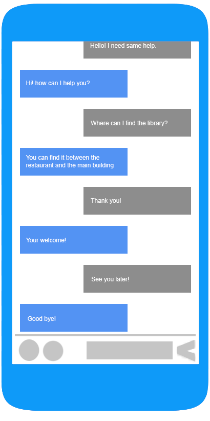

### Czikó Tivadar Miskolci Egyetem Programtervező Informatikus alapszakos hallgatójának egyetemi szakmai gyakorlata.

#### Chatbot feladata:
> A chatbot célja az egyetemen lévő emberek tájékozódásának elősegítése, egy közösségi felületen
> tud segíteni az embereknek. Úgy segít, hogy az adott személy beírja a terem valamelyik paraméterét és 
> erre válaszként elküldi a terem többi paraméterét információját és esetleg egy képet, ahol meg van jelölve a térképen, hogy 
> nagyjából hol található.
  
#### Megvalósítása:
> A chatbot elkészítéséhez  a Python nyelvet találtam alkalmasnak. Mivel a Python kiterjedt könyvtárral rendelkezik ami elősegíti a mesterséges  intelligenciával való munkát és a python gépi tanulás algoritmusát, algoritmusainak kombinációit használja, hogy ezzel több felé választ generáljon. Ez a funkció teszi  lehetővé a fejlesztők számára azt, hogy olyan chat robotot hozzanak létre amelyik képesek releváns válaszokat adni.
 
> A Pythonban való programozást PyCharm IDE fogom megvalósítani, mert ezt találtam legprofesszionálisabbnak, átláthatóbbnak, JetBrains program család része amit már jól ismerek, használtam más programozási nyelveknél és Egyetemi hallgatói liszensszel, egy éven keresztűl ingyenesen használható.
	
> Legelőször angol nyelven szeretném megvalósítani (mivel ez egy világnyelv), de későbbiekben szeretnék egy magyar nyelvű változatot is.
> 
#### Látványterv: 

    
    

