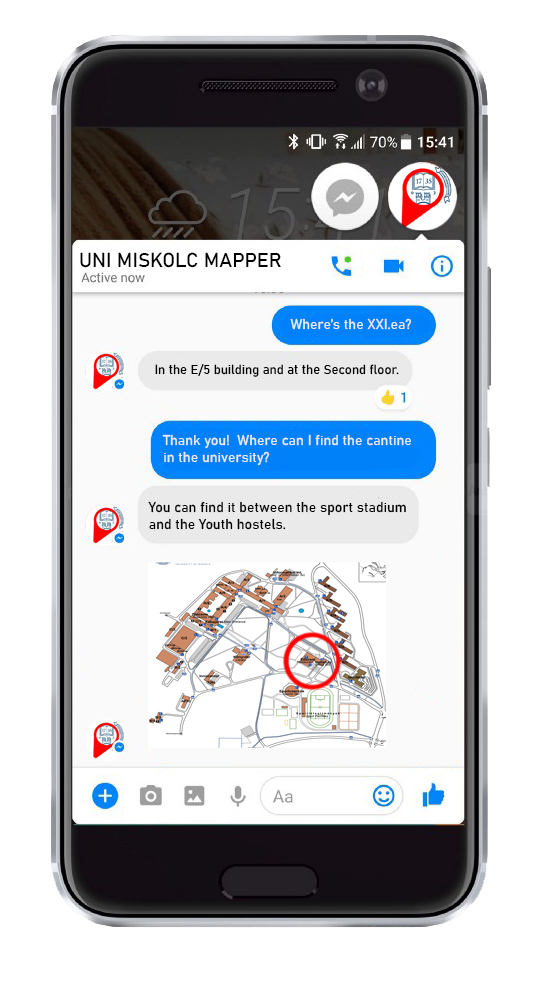

### Czikó Tivadar Miskolci Egyetem Programtervező Informatikus alapszakos hallgatójának egyetemi szakmai gyakorlata.

#### Chatbot feladata:
> A chatbot célja az egyetemen lévő emberek tájékozódásának elősegítése, egy közösségi felületen.
> tud segíteni az embereknek. Úgy tud segíteni, hogy az adott személy beírja a terem valamelyik paraméterét és 
> erre válaszként elküldi a terem többi paraméterét információját és esetleg egy képet, ahol meg van jelölve a térképen, hogy 
> nagyjából hol található.
  
#### Megvalósítása:
> A chatbot elkészítéséhez  a Python nyelvet találtam alkalmasnak és a messenger felületét. Mivel a Python kiterjedt könyvtárral rendelkezik ami elősegíti a mesterséges  intelligenciával való munkát és a python gépi tanulás algoritmusát, algoritmusainak kombinációit használja, hogy ezzel több felé választ generáljon. Ez a funkció teszi  lehetővé a fejlesztők számára azt, hogy olyan chat robotot hozzanak létre amelyik képesek releváns válaszokat adni. 

> A Pythonban való programozást PyCharm IDE fogom megvalósítani, mert ezt találtam legprofesszionálisabbnak, átláthatóbbnak, JetBrains program család része amit már jól ismerek, használtam más programozási nyelveknél és Egyetemi hallgatói liszensszel, egy éven keresztűl ingyenesen használható.
	
> A Facebook messenger felületét azért választottam mert jelenleg ez az egyik legfelkapottabb social media felület magyarországon (jelenleg 7.35 millió Magyarországi 
> felhasználó van. *Forrás:[ • Hungary: number of Facebook users 2022 | Statista](https://www.statista.com/statistics/1029770/facebook-users-hungary/#:~:text=The%20number%20of%20Facebook%20users,media%20platform%20in%20the%20country.)*). Mivel a Miskolci egyetem számos külföldi diák is tanúl és a 2024 Európai 
> diákjátékokat a Miskolci és a Debreceni Egyetem közösen szervezi és Európán belül is nagyon sok felhasználóval rendelkezik. 
> (Jelenleg 307 millió. *Forrás: [• Europe: number of Facebook users 2022 | Statista](https://www.statista.com/statistics/745383/facebook-europe-dau-by-quarter/)*). 

> Legelőször magyar nyelven szeretném megvalósítani (mivel ez az anyanyelvem), de későbbiekben szeretnék egy angol nyelvű változatot is, hogy minél több ember tudja
> majd igénybe venni (azért angol nyelven mert jelenleg ez a legtöbbet beszélt és tanult idegen nyelv). 

#### Látványterv: 

